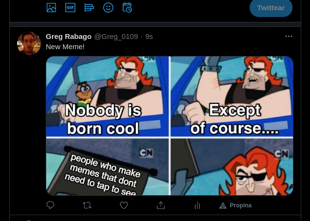

# Ruby Capstone

This is a twitter bot, it scrappes memes from the /r/memes subreddit and uploads them to twitter
It has been made using ruby with some classes to take the load from the main script. I corrected the errors using Rubocop and used RSpec to do the testing

## Screenshot



## Built With

- Ruby
- Rubocop
- RSpec
- Linter

## Getting Started

First ensure that you have ruby installed on your local machine.

To get a local copy up and running follow these simple example steps.

## Prequisites

Ruby installed on your local machine.
Terminal or similar to execute the program.

### Gem libraries used
- httparty
- nokogiri
- twitter
- open-uri

To install those libraries, simply use terminal like so ```sudo gem install [library name]```

## Install

Download a copy of the repository

## Usage

In terminal, cd to the folder ```cd RubyCapstone```
Execute in terminal like so ```ruby bin/main.rb```

## Testing
In this project the testing was done using RSpec to test all game logic methods.

# Install
- In a terminal window type gem install rspec
- Once rspec install has finished, type rspec --init
- You will see a folder spec and a file .rspec
- Inside spec folder you'll see a spec_helper.rb file.

# Run
I have already created rspec-testing files called meme_retriever_spec.rb.
- go to the folder inside your terminal type rspec
- If all test pass you will see:
 `2 examples, 0 failures`


## Authors

👤 Gregorio Rábago Sainz

- GitHub: [@Greg0109](https://github.com/greg0109)
- Twitter: [@Greg_0109](https://twitter.com/greg_0109)

## 🤝 Contributing

Contributions, issues, and feature requests are welcome!

Feel free to check the [issues page](https://github.com/sergiocortessat/RubyCapstone/issues).

## Show your support

Give a ⭐️ if you like this project!

## 📝 License

This project is [MIT](LICENSE) licensed.
