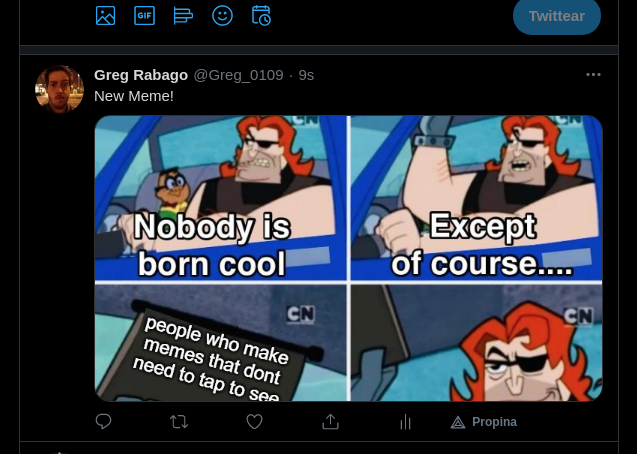

# Ruby Capstone

> Creating first repository with Linter, separate commits and a HTML and CSS file

This is a twitter bot, it scrappes memes from the /r/memes subreddit and uploads them to twitter

## Screenshot



## Built With

- Ruby
- Rubocop
- Linter

## Getting Started

First ensure that you have ruby installed on your local machine.

To get a local copy up and running follow these simple example steps.

## Prequisites

Ruby installed on your local machine.
Terminal or similar to execute the program.

### Gem libraries used
- httparty
- nokogiri
- twitter
- open-uri

To install those libraries, simply use terminal like so ```sudo gem install [library name]```

## Install

Download a copy of the main.rb file and all the files in the lib

## Usage

In terminal, cd to the folder ```cd RubyCapstone```
Execute in terminal like so ```ruby main.rb```


## Authors

👤 Gregorio Rábago Sainz

- GitHub: [@Greg0109](https://github.com/greg0109)
- Twitter: [@Greg_0109](https://twitter.com/greg_0109)

## 🤝 Contributing

Contributions, issues, and feature requests are welcome!

Feel free to check the [issues page](https://github.com/sergiocortessat/RubyCapstone/issues).

## Show your support

Give a ⭐️ if you like this project!

## 📝 License

This project is [MIT](LICENSE) licensed.
